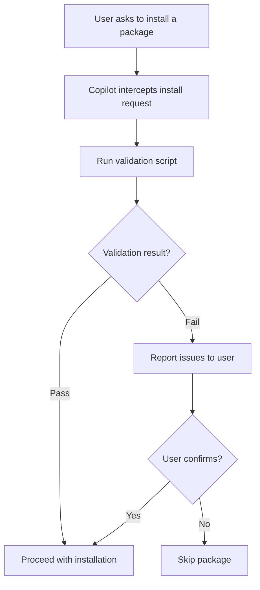

# Safe Install Skill

**Skill File**: [`.github/skills/safe-install/SKILL.md`](../../.github/skills/safe-install/SKILL.md)

## Overview

The Safe Install skill prevents supply chain attacks by validating every package before installation. It intercepts all package install commands (npm, pip, yarn, pnpm, uv) and runs security checks against typosquatting, known vulnerabilities, and suspicious metadata.

This skill is enforced via [`.github/copilot-instructions.md`](../../.github/copilot-instructions.md), which instructs Copilot to **never** run install commands directly.

> **Important:** This skill is triggered regardless of context. If Copilot autonomously decides to install a package while implementing a feature (e.g., it determines a library is needed to complete a task), the validation still runs before any install command is executed. The protection applies whether the user explicitly asks to install something or Copilot initiates the install on its own.


## How It Works



### Step-by-Step Process

1. **User requests a package install** (e.g., "add axios to the project")
2. **Copilot invokes the validation script** instead of running install directly
3. **Script checks** for typosquatting, age, popularity, and known vulnerabilities
4. **If safe** → Copilot proceeds with the install command
5. **If suspicious** → Copilot reports findings and asks for explicit confirmation


## What It Checks

| Check | Description |
|-------|-------------|
| Typosquatting | Levenshtein distance against popular package names |
| Package Age | Flags very recently published packages |
| Download Count | Flags packages with suspiciously low downloads |
| Known Vulnerabilities | Checks for reported CVEs |
| Metadata | Validates author, repository, and description fields |


## Supported Ecosystems

| Ecosystem | Install Commands Covered |
|-----------|--------------------------|
| npm | `npm install`, `npm i`, `npm add`, `yarn add`, `pnpm add` |
| PyPI | `pip install`, `pip3 install`, `python -m pip install`, `uv add`, `uv pip install` |


## Example Interactions

### Typosquatting detected

```
User: "Install lod-ash"
Copilot: ❌ `lod-ash` was BLOCKED — it's suspiciously similar to the popular
         package `lodash`. Did you mean `lodash`?
```

### Clean install

```
User: "Add requests and fastapi"
Copilot: ✅ Both packages validated and installed.
```


## Configuration

### Custom Instructions

The [`.github/copilot-instructions.md`](../../.github/copilot-instructions.md) file enforces that Copilot always uses this skill before installing packages. It also defines code security guidelines for generated code.

### Validation Scripts

| Platform | Script |
|----------|--------|
| Windows (PowerShell) | `.github/skills/safe-install/scripts/validate-package.ps1` |
| macOS/Linux (Bash) | `.github/skills/safe-install/scripts/validate-package.sh` |

### Edge Cases

- **Installing from `requirements.txt` / `package.json`**: Allowed without validation (pre-vetted)
- **Local packages** (paths, `.whl`, `.tar.gz`): Allowed without validation
- **Private registries**: Validation only covers public registries; a warning is shown

---
