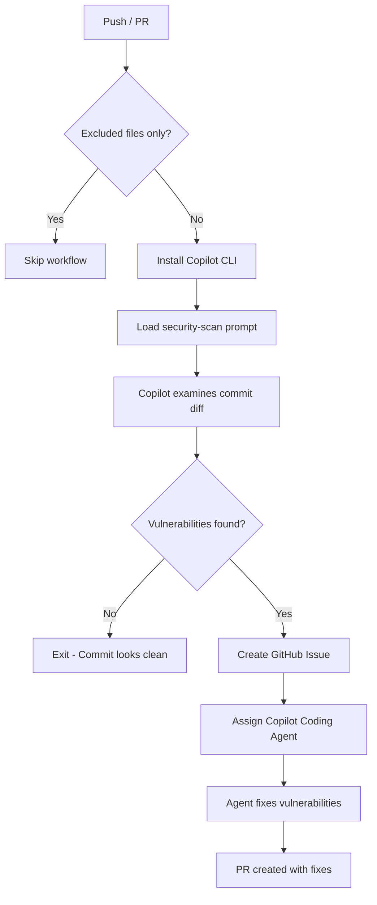

# Security Scan Workflow

**Workflow File**: [`.github/workflows/security-scan.yml`](../../.github/workflows/security-scan.yml)

## Overview

The Security Scan workflow leverages GitHub Copilot CLI to analyze commits for security vulnerabilities based on the OWASP Top 10. When vulnerabilities are found, it automatically creates a GitHub issue with detailed findings and assigns Copilot to remediate them.


## How It Works



### Step-by-Step Process

1. **Triggers on push or pull request to main/master** (excluding docs and markdown files)
2. **Installs Copilot CLI** in the GitHub Actions runner
3. **Loads the security-scan prompt** from [`.github/prompts/security-scan.prompt.md`](../../.github/prompts/security-scan.prompt.md)
4. **Copilot examines the commit** using MCP tools to access diffs and file contents
5. **If vulnerabilities are found** → Creates a GitHub issue with severity, affected files, and remediation steps, then assigns Copilot
6. **Copilot Coding Agent** then implements the security fixes


## Vulnerability Categories

### What It Scans For

| Category | Examples |
|----------|----------|
| Injection Attacks | SQL injection, command injection, XSS via unsanitized input |
| Broken Access Control | Missing auth checks, insecure direct object references |
| Cryptographic Failures | Hardcoded secrets, weak hashing, credentials in source |
| Insecure Design | Missing input validation, error handling that leaks internals |
| Security Misconfiguration | Overly permissive CORS, debug mode enabled, default credentials |
| Vulnerable Dependencies | Known vulnerable packages, outdated dependencies with CVEs |
| Authentication Failures | Weak password policies, missing rate limiting, session issues |
| Data Integrity Failures | Unsigned serialization, untrusted deserialization |
| Logging & Monitoring Failures | Sensitive data in logs, missing audit trails |
| SSRF | Unvalidated URLs, user-controlled requests to internal services |


## Issue Format

When vulnerabilities are detected, the created issue includes:

- **Title**: `🔒 Security vulnerabilities found in commit [short SHA]: [commit message]`
- **Labels**: `security`, `automated`
- **Body**:
  - Summary of each vulnerability
  - Severity level (Critical / High / Medium / Low)
  - Affected file(s) and line numbers
  - Recommended remediation steps
  - Relevant OWASP category reference


## Configuration

### Trigger Configuration

The workflow runs on pushes and pull requests:

```yaml
on:
  push:
    paths-ignore:
      - 'docs/**'
      - '**.md'
  pull_request:
    branches:
      - main
      - master
    paths-ignore:
      - 'docs/**'
      - '**.md'
```

### Required Secrets

| Secret | Description |
|--------|-------------|
| `COPILOT_CLI_TOKEN` | Personal Access Token with Copilot permissions |

---
